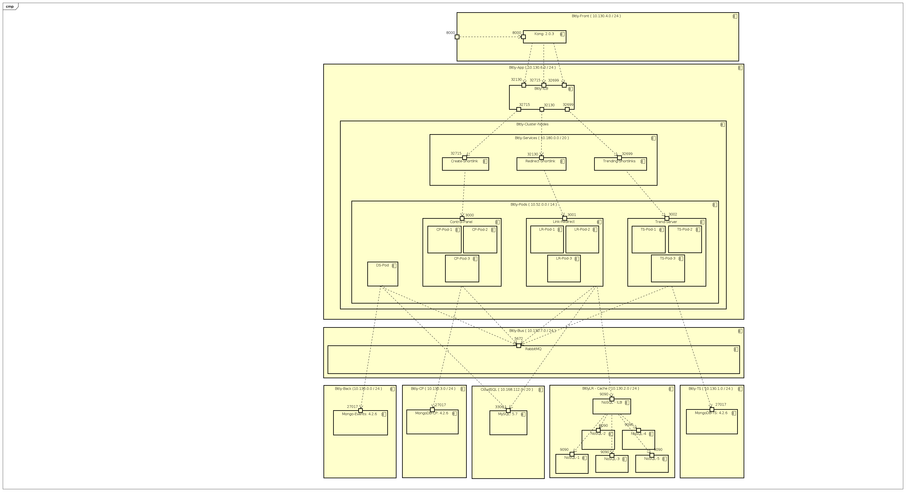

# bit.ly clone

## [Video Presentation](https://youtu.be/ha8RUo_m2HM)

---
##### Deployment Diagram
[Bitly-Clone Deployment Diagram](design/01.bitly-diagram.png)

##### Project networks ( with GKE cluster)
[VPC and subnetworks](design/02.bitly-network.png)

[Firewall Rules](design/03.bitky-network-firewall.png)

[Instances and Network Tags](design/04.bitly-network-tags-and-instances.png)

##### Google Kubernetes Engine

[Cluster Info](design/05.bitly-gke.png)

[Service Endpoints](design/06.bitly-gke-service-endpoints.png)

[Load Balancer](design/07.bitly-gke-load-balancer.png)

[Testing Service NodePort](design/08.bitly-gke-node-ports.png) ( From Kong instance, _through_ the load balancer )

##### Testing API through Kong

[Declarative Kong Config](design/09.bitly-kong-declarative-config.png)

[Create some Shortlinks](design/10.bitly-create-shortlinks.png)

[Visit some URLs](design/11.bitly-visit-shortlinks.png)

[Check trending URLs](design/12.bitly-trending-links.png)

##### CQRS

- _CREATE shortlink_ and _UPDATE visit_ requests are sent to the queue and handled by each service's consumers
- READ requests go directly to the databases
  - LR Server -> NoSQL Cache -> MySQL
  - Trend Server -> MongoDB

[CQRS](design/13.bitly-cqrs.jpeg)

[CQRS-2](design/14.bitly-cqrs-2.jpeg)

##### Event Sourcing

Messages from the bus with routingkeys of CREATE and UPDATE are stored in the mongodb event-store. ( see above: CQRS )
- cp.shortlink.create --- create new shortlink
- lr.shortlink.update --- update visits

[Event-Sourcing](design/15.bitly-event-sourcing.png)

##### Some issues faced during project ( Journal )

- **Problem**: how to access rabbitmq dashboard over internet
  - _Solution_: SSH Tunnel through google cloud SDK
- **Problem**: Instances crash on start up because they cannot connect to their databases
  - _Solution-1_: Open all ports to addresses in VPC CIDR block
  - _Solution-2_: Separate instances into logical subnetworks and configure firewall rules using network tags
- **Problem**: Changing environment variables in Dockerfile requires re-building docker image.
  - _Solution_: Set environment variables on Compute Engine or GKE deployment start-up
- **Problem**: GKE fails to pull image from docker hub
  - _Solution_: Push to Google's container registry GCR
- **Problem**: Container images are too large to push on DSL connection.
  - _Solution-1_: Use alpine linux for golang containers
  - _Solution-2_: Remove yum install package command from NoSQL Dockerfile
      - Bonus: Finally realize what the image layers represent
- **Problem**: Where do we get new shortlinks from?
  - _Solution-1_: Use inserted MySQL index ( increment a counter )
  - _Solution-2_: Hash the URL
  - _Solution-3_: Randomize strings and maintain key-value table of assigned shortlinks
  - _Solution-4_: Pre-generate and assign shortlinks as needed

---

### Link to Kong API Gateway -- External IP: [34.71.111.143:8000](34.71.111.143:8000)

##### Control Panel API
**/cp/ping --- GET**
```
Sample Response:
{
  "CP Server: a957fa7d-e579-494c-b25e-b822afd500e2 - API version 3.0 alive!"
}
```
**/cp/link_save --- POST**
```
Sample Request:
{
  "OrigUrl":"aws.amazon.com"
}
```
```
Sample Response:
{
  "ShortUrl": "vA"
}
```
---
##### Link Redirect API
**/lr/ping --- GET**
```
Sample Response:
{
  "LR Server: 2df9c7bd-04d8-4427-a193-29d77594e3ff - API version 3.0 alive!"
}
```
**/lr/r/{shortlink} --- GET**
```
Sample Response:
{
  "OrigUrl": "aws.amazon.com"
}
```
---
##### Trend Server API
**/ts/ping --- GET**
```
Sample Response:
{
  "Test": "TS Server: 5f75372c-89ff-48e6-ba79-359bef38f546 - API version 3.0 alive!"
}
```
**/ts/t/{shortlink} --- GET**
```
Sample Response:
{
  "OrigUrl": "aws.amazon.com",
  "ShortUrl": "vA",
  "Visits": 2
}
```
**/ts/t/merge --- GET**
```
Sample Response:
[
  {
    "OrigUrl": "ifconfig.co",
    "Visits": 3
  },
  {
    "OrigUrl": "aws.amazon.com",
    "Visits": 2
  },
  {
    "OrigUrl": "gobyexample.com",
    "Visits": 2
  },
  {
    "OrigUrl": "one.sjsu.edu",
    "Visits": 1
  },
  {
    "OrigUrl": "sjsu.instructure.com",
    "Visits": 1
  }
]
```
---

#### Database Schemas

**Main MySQL Database ( tiny_urls )**

key|name     |type
---|---------|-----------
PK |id       |bigint(20)
   |orig_url |varchar(512)
   |short_url|varchar(45)
   |visits   |int(11)
   |created  |timestamp

**Event-Store ( eventlogs )**

key|name      |type
---|----------|-----------
PK |\_id      |TimeUUID  
   |routingkey|String  
   |body      |QueueMessage

**UDT: QueueMessage**
```
{
  "origurl" : "cloud.google.com",
  "shorturl" : "A4"
}
```

**Trend Server ( visits )**

key|name           |type
---|---------------|-----------
PK |\_id (shorturl)|String  
   |origurl        |String  
   |visits         |Integer  

**Control Panel ( shortlinks )**

key|name           |type
---|---------------|-----------
PK |\_id (shorturl)|String  

**LR Cache ( NoSQL Project )**

key|name           |type
---|---------------|-----------
PK |key (shorturl) |String  
   |value (origurl)|String  

---
